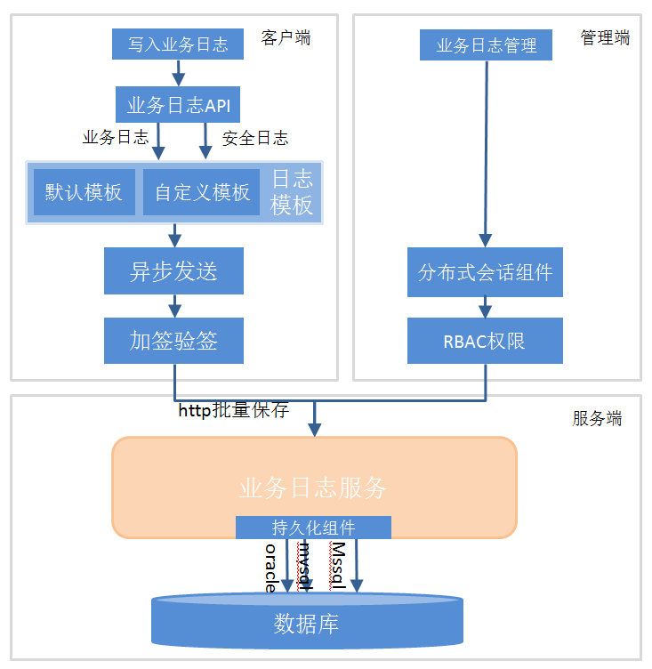
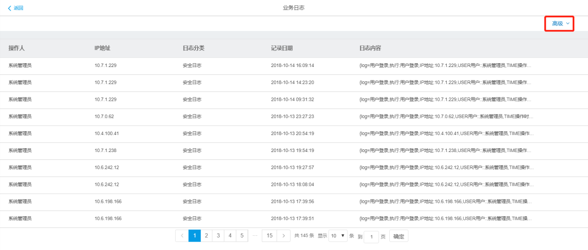
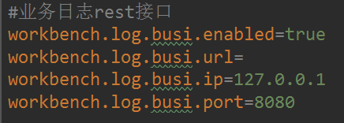
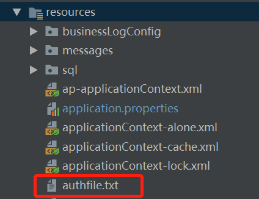

# iuap应用平台红皮书

## 业务日志组件

2019年

用友网络科技股份有限公司


此文档为保密文档，未经用友软件股份有限公司书面同意，不得向任何单位或个人提供、转让本文档中的任何内容，用友软件股份有限公司将保留对泄漏文档内容的起诉权利。


## 版权

©2019用友集团版权所有。
未经用友集团的书面许可，本文档描述任何整体或部分的内容不得被复制、复印、翻译或缩减以用于任何目的。本文档描述的内容在未经通知的情形下可能会发生改变，敬请留意。请注意：本文档描述的内容并不代表用友集团所做的承诺。


iuap平台红皮书

<table>
   <tr>
      <td rowspan="4">文件状态：<br/>
        [ ] 草稿<br/>
        [√]正在修改<br/>
        [ ] 正式发布<br/>
      </td>
      <td>文件标识：</td>
        <td>无</td>
   </tr>
   <tr>
      <td>当前版本：</td>
      <td> V3.5.5</td>
   </tr>
   <tr>
      <td>作者：</td>
      <td>张涛</td>
   </tr>
   <tr>
      <td>完成日期：</td>
      <td>2018/12/27</td>
   </tr>
</table>

**版本历史**

| 版本 | 作者 | 参与者 | 起止日期 | 备注 |
| --- | --- | --- | --- | --- |
| V3.5.2 | 范传军 |   | 2018.10.13-2018.10.15 | 第一次评审 |
| V3.5.3 | 范传军 |   | 2018.10.16- |   |
| V3.5.5 | 张涛 |   | 2018.12.27 |   |
|   |   |   |   |   |
|   |   |   |   |   |
|   |   |   |   |   |
|   |   |   |   |   |

**审核记录**

| 版本 | 姓名 | 职位 | 审阅日期 | 备注 |
| --- | --- | --- | --- | --- |
|   |   |   |   |   |
|   |   |   |   |   |
|   |   |   |   |   |
|   |   |   |   |   |
|   |   |   |   |   |
|   |   |   |   |   |
|   |   |   |   |   |
|   |   |   |   |   |
|   |   |   |   |   |

## 目录

版权

第一章 基本概念

第二章 技术架构

2.1 技术架构

2.2 实现原理

2.3 扩展机制

2.3.1 日志模板

2.3.2 日志类型与日志输出

第三章 功能介绍

3.1 业务日志

第四章 开发示例

4.1 开发环境配置

4.2 添加注解

4.2.1 使用注解及默认模板发送日志

4.2.2 使用注解及自定义模板发送日志

第五章 典型业务场景介绍

5.1 登入场景

5.1.1 目标

5.1.2 实现

5.1.3 效果

5.2 组织新增

5.2.1 目标

5.2.2 实现方式

5.2.3 效果

第六章 开放接口规范

6.1 日志sdk接口

6.1.1 使用默认模板发送业务日志

6.1.2 使用自定义模板发送业务日志

6.1.3 使用默认模板及日志类型发送日志

6.1.4 使用自定义模板及日志类型发送日志

6.1.5 使用自定义模板及日志类型自定义日志输出

6.2 日志注解规范

6.3 加签REST接口

6.3.1 业务日志分页查询

6.3.2 业务日志单条写入

6.3.3 业务日志批量写入


## **第一章** 基本概念

所谓业务日志，就是用于记录业务信息和用户的操作，例如用户登录、删除数据、更新数据等。业务日志最大的特点就将业务逻辑和日志记录进行的分离，解决了业务逻辑代码和日志记录代码混合一起的问题，便于业务逻辑和日志记录分开维护，让日志的记录对业务方法尽量无侵入，尽最大可能地不影响业务方法的性能。

对比以下的一个记录日志的现实场景，将业务逻辑和日志记录混合在一起了，场景如下：

我们对于记录（也叫业务日志）的操作，很多时候是这样编码的：
```
// 创建一家公司
public Organization createCompany(CompanyDto dto) {
    // 执行业务方法
    companyDAO.save(dto);
    // 记录日志
    LogDAO.save(new BusinessLog(userDAO.getSubjectName() + "，创建子公司：" + dto.getCompanyName()));
}
```
最后结果就是：
```
    1. 新公司的创建
    2. 业务日志：张三，创建子公司：广州子公司
```

咋一看这样写没有什么问题，但是其中有一个最大的问题： **业务逻辑和日志逻辑的混在一起。**

如果业务逻辑和日志逻辑足够复杂的时候，你可以想像你的代码就如同意大利面一样。以后维护的时候，就会变成人间地狱！

业务日志组件可以解决此问题： **业务逻辑和日志逻辑&quot;分离&quot;！**

业务日志组件的目标

1. 日志的记录对业务方法尽量 **无侵入**

2. 尽最大可能不影响业务方法的性能

3. 系统及日志模板配置简单

4. 日志持久化(也称为导出日志)方式灵活

5. 修改日志模板而不需要重启应用

事实上，要达到真正的无侵入是不可能的，业务日志组件对业务方法的侵入只不过是要在业务方法上加上一个注解。

## **第二章** 技术架构

### 2.1 技术架构

业务日志组件提供了业务日志的管理端以及业务日志sdk，业务日志组件集成了分布式会话组件及RBAC权限组件，以便支持业务日志在管理端会话验证与权限验权，集成持久化组件支持oracle、mysql和sqlserver数据库。

为客户端提供aop以及sdk-api的调用方式，支持默认模板和自定义模板，支持异步加签调用实现日志数据的批量保存；业务日志的技术组件架构如图2.1-1所示，


<center>图2.1-1</center>

### 2.2 实现原理

在业务方法上添加了@LogConfig注解后，组件通过SpringAOP进行拦截。当Spring察觉到加注解的业务方法被调用的时候，即可对此方法进行日志记录。

本组件可以通过Groovy脚本配置日志模版，定义拦截的业务方法的参数。日志注解@LogConfig(&quot;业务方法别名&quot;)用来给需要日志记录的方法链接日志模版，不同的业务方法可以有不同的日志模板。同时对于日志内容的输出也是可配置的，用户可以自定义来实现对业务日志的持久化操作。
```
@Component
@Aspect
public class WBLogAspect {
    /**
     * 标签实现业务日志
     * @param joinPoint
     * @param retValue
     * @return
     */
    @AfterReturning(value = "@annotation(com.yonyou.uap.busilog.annotation.LogConfig)",returning="retValue")
    public void after(JoinPoint joinPoint,Object retValue) {
        log(joinPoint, retValue, null);
    }
    /**
     * 标签实现业务异常日志
     * @param joinPoint
     * @param error
     * @return
     */
    @AfterThrowing(value = "@annotation(com.yonyou.uap.busilog.annotation.LogConfig)", throwing = "error")
    public void AfterThrowing(JoinPoint joinPoint ,Throwable error)  {
        log(joinPoint, null, error);
    }
	… …
}
```

### 2.3 扩展机制
#### 2.3.1 日志模板

支持默认模板和自定义模板两种配置:

**默认模板：**

可以在不定义日志模板的情况下，可以使用默认模板，默认模板结构如下：
```
_billName,执行: _logOperation,IP地址:_ip,USER用户:_user,TIME操作时间:_time执行结果: _methodReturn
```

**自定义模板：**

也可以通过groovy提供的模板文件定义的日志模板内容：
```
class BusinessLogConfig_ygdemo {
    def context;
    def Ygdemo_yw_info_save() {
        "督办任务：执行保存方法:IP地址为${context._ip},USER用户为${context._user},TIME操作时间为${context._time},编码为${context._methodReturn.code},名称为${context._param0.name}"
    }
}
```

配置模板实际上是一个Groovy类，你可以在类中定义任何方法。如果方法为某个业务方法的别名（使用&#39;@LogConfig&#39;注解）那么，我们就认为它是一个业务日志方法。它的返回值（return或者放在方法最后一行的变量）将会被Set到&#39; com.yonyou.uap.busilog.entity.LogDto&#39;的实例中。日志方法返回值只返回一个String类型的日志文本；

在类中，还可以使用Groovy定义变量的方法：&#39;def context&#39; 定义一个变量。这个变量实际上是一个Map。 Map中存储的是业务方法的 &#39;返回值&#39;、&#39;参数&#39;。如果需要，你可以存储任何你需要的数据。你可以从这个context中取出你需要的内容，填充到你的日志中。至于如何取context中的内容，请看：
在日志模板中取&#39;context&#39;的内容：

| key | value |
| --- | --- |
| \_methodReturn | 业务方法返回值 |
| \_param | 业务方法的参数, \_param0代表第一个参数 \_param1代表第二个参数，依此类推 |
| \_executeError | 业务方法执行失败的异常信息 |
| \_businessMethod | 业务方法 |
| \_user | 业务方法操作人 |
| \_time | 业务方法操作时间 |
| \_ip | ip地址 |

多文件配置：在类路径中加入&#39;businessLogConfig&#39;文件夹。在该文件夹中加入日志配置文件，文件名任意，只要符合Groovy类文件的命名规范即可。

注：支持多文件配置，businessLogConfig&#39;文件夹中的所有以&#39;.groovy&#39;结尾的文件都将被作为日志配置文件。

#### 2.3.2 日志类型与日志输出

在@LogConfig以及LogCenter的api中logTypeCode与logTypeName都支持自定义日志类型；

并且writerClass日志输出支持替换为自定义的日志存储；需要实现接口的com.yonyou.uap.busilog.writer.itf.ILogWriter

提供通过配置的方式支持日志输出的开关workbench.log.busi.enabled

## **第三章** 功能介绍

### 3.1 业务日志

点击管理中心主界面上的【业务日志】，进入业务日志管理界面，如下图所示：


<center>图 2</center>

界面上显示业务日志的相关信息，包括操作人、IP地址、日志分类、记录日期和日志内容。点击右上角的〖高级〗，可以检索日志。


<center>图 3</center>

可以选择按操作人、日志分类或记录日期来检索日志。按〖清空〗清空检索项。按〖收起〗退出检索界面。

按〖返回〗返回管理中心主界面。


<center>图 4</center>

可以对日志内容详细进行查看，点击日志内容即可展开查看，关闭可以收藏起详细日志内容。

## **第四章** 开发示例

### 4.1 开发环境配置

1.xml上增加如下配置，添加依赖的业务日志sdk包
```
    <dependency>
        <groupId>com.yonyou.iuap.pap.busilog</groupId>
        <artifactId>iuap-busilog-sdk</artifactId>
        <version>${project.version}</version>
    </dependency>

```

2.由于sdk使用LogRestWriter进行加签调用iuap-saas-busilog-service的服务，所以需要配置服务地址与加签相关信息

2.1) application.properties


<center>图 5</center>

a) workbench.log.busi.enabled是业务日志输出的开关，当值为true时，会输出业务日志，当值为false时，不会输出业务日志；

b) workbench.log.busi.url=http://ip:port/iuap-saas-busilog-service设置不为空时，优先使用

c) workbench.log.busi.ip在workbench.log.busi.url配置为空的情况下使用有效；用于配置业务日志服务的地址

d) workbench.log.busi.port在workbench.log.busi.url配置为空的情况下使用有效；用于配置业务日志服务的地址

e) 在workbench.log.busi.url与workbench.log.busi.ip及workbench.log.busi.port都不设置的情况下，默认值为127.0.0.1:8080；workbench.log.busi.enabled在没有设置的情况下，默认值为true

2.2) 需要在项目的resources目录放置authfile.txt用于业务日志加签服务验证；该文件需要和开发应用平台的authfile.txt一致


<center>图 6</center>

3.修改配置文件，需要在spring-mvc.xml或者applicationContext.xml中配置
```
<!-- 启动对@AspectJ注解的支持 -->
<aop:aspectj-autoproxy/>
<!-- 通知spring使用cglib而不是jdk的来生成代理方法 AOP可以拦截到Controller -->
<aop:aspectj-autoproxy proxy-target-class="true" />
```

### 4.2 添加注解

在上述配置完成之后，就可以使用业务日志；使用业务日志有两种方式，第一种是通过sdk提供的接口的直接调用，sdk接口详细请查阅第六章开放接口章节；第二种是通过注解的方式使用业务日志；可以根据自己需要进行选择，此处以注解方式进行说明；

#### 4.2.1 使用注解及默认模板发送日志

为业务方法加上@ LogConfig注解，如下形式：
```
package com.yonyou.iuap.example.service;
import com.yonyou.uap.busilog.annotation.LogConfig;

public class Ygdemo_yw_infoService {
	// 需要被日志记录的方法
	@ LogConfig(busiCode = "ygdemo_save", busiName = "督办任务",operation = "督办任务保存")
	public Ygdemo_yw_info save(Ygdemo_yw_info entity){
		System.out.println("BusinessService.excute()");
	}
}
```

注解说明：

| **参数** | **参数类型 ** | ** 是否必须** | **说明** |
| --- | --- | --- | --- |
| busiName | String | 是 | 业务名称 |
| busiCode | String | 是 | 业务代码 |
| logTypeCode | String | 否 | 日志类型：默认为&quot;busiLog&quot; |
| logTypeName | String | 否 | 日志类型名称默认为&quot;业务日志&quot; |
| operation | String | 是 | 执行操作描述 |
| templateId | String | 否 | 模板id |
| writerClass | Class<? extends ILogWriter> | 否 | 日志输出类；默认使用LogRestWriter |

日志类型名称与编码：

    业务日志 busiLog

    安全日志 security\_log

    审计日志 aduitLog

    操作日志 operateLog


#### 4.2.2 使用注解及自定义模板发送日志

为业务方法加上@LogConfig注解并且指定templateId，如下形式：
```
package com.yonyou.iuap.example.service;
import com.yonyou.uap.busilog.annotation.LogConfig;

public class Ygdemo_yw_infoService {
	// 需要被日志记录的方法
	@ LogConfig(busiCode = "ygdemo_save", busiName = "督办任务",operation = "督办任务保存", templateId = "Ygdemo_yw_info_save")
	public Ygdemo_yw_info save(Ygdemo_yw_info entity){
		System.out.println("BusinessService.excute()");
	  }
}
```

相对于使用默认模板，这里的示例多了一项配置templateId = &quot;Ygdemo\_yw\_info\_save&quot;，可以理解为使的模板id是Ygdemo_yw_info_save；那么模板又配置在哪里呢？

开发阶段，对于自定义的模板需要放在项目的resource/businessLogConfig目录下，并且以.groovy文件结尾；模板文件名可以任意定义；


<center>图 7</center>

该文件需要符合groovy语法，示例文件内容结构如下：
```
class BusinessLogConfig_ygdemo {
def  context;
def  defMsgStr="督办任务：";

def  defMsgFun(){
		       "IP地址为${context._ip},USER用户为${context._user},TIME操作时间为${context._time}"
	}

    def  Ygdemo_yw_info_save() {
        "${defMsgStr}执行保存方法: ${defMsgFun()},编码为${context._methodReturn.code},名称为${context._param0.name}"
    }

    def  Ygdemo_yw_info_selectAllByPage() {
       "督办任务：执行查询方法:IP地址为${context._ip},USER用户为${context._user},TIME操作时间为${context._time}"
    }
}
```

说明：

在groovy模板文件中，对于多次使用的常量可以定义成公用变量，然后使用${变量名}获取值，例如： defMsgStr=&quot;督办任务：&quot;。对于多次使用的变量可以定义成公用方法，将多次使用的变量放在方法中，然后使用${方法名()}获取相应的值，例如上文中：
```
def  Ygdemo_yw_info_selectAllByPage() {
       "督办任务：执行查询方法:IP地址为${context._ip},USER用户为${context._user},TIME操作时间为${context._time}"
}
```

就可替换为：
```
def  Ygdemo_yw_info_selectAllByPage() {
       "${defMsgStr}执行查询方法: ${defMsgFun()}"
}
```
即可。

## **第五章** 典型业务场景介绍

在系统的登入登出、权限发生变更记录日志类型为安全日志；在功能节点发生操作的情况下，记录业务日志

### 5.1 登入场景

想要感知到系统中用户的登录情况，了解系统中每个用户在什么时间在哪台ip机器上进行过登陆操作；感知到用户的足迹…

#### 5.1.1 目标

能够记录用户在什么时间、在哪个ip、做了登陆操作、操作结果

#### 5.1.2 实现

如下是登陆记录业务日志关键方法，通过参数获取客户端ip，以及判断当前方法调用时是登陆成功还是失败；使用LogCenter.sendLog的sdk-api进行用户登录的日志记录；日志类别设置为安全日志
```
private void writeBusiLog(User user,Object... obj){
   String clientIp = (String) obj[0];
   Map<String,Object> extMap = new HashMap<>(25);
   extMap.put(LogContextKeyConstant.BUSINESS_OPERATION_IP, clientIp);
    String loginStatus = null;
    if(obj.length==1){
        loginStatus = IConst.LOGTYPE_SUCCESS;
    }else{
        loginStatus = (String) obj[1];
    }
	//根据不同的登陆状态记录用户登录信息，失败情况下，要记录失败原因
    if(IConst.LOGTYPE_SUCCESS.equals(loginStatus)){
        LogCenter.sendLog(BusiLogProperties.USER_LOGIN_NAME, BusiLogProperties.USER_LOGIN, BusiLogProperties.LOG_TYPE_SECURITY_CODE, BusiLogProperties.LOG_TYPE_SECURITY_NAME, "用户登录", user.getUserId()+":登录wbalone", "",extMap);
    }else{
        Object loginError = obj[2];
        LogCenter.sendLog(BusiLogProperties.USER_LOGIN_ERROR_NAME, BusiLogProperties.USER_LOGIN_ERROR, BusiLogProperties.LOG_TYPE_SECURITY_CODE, BusiLogProperties.LOG_TYPE_SECURITY_NAME, "用户登录失败", (StringUtils.isEmpty(user.getUserId())?user.getUserCode():user.getUserName()) + ":登录wbalone", (loginError==null)?"登录失败": (String) loginError, extMap);
    }
}

```

#### 5.1.3 效果


<center>图 8</center>

### 5.2 组织新增

想要感知到系统中用户的登录情况，了解系统中每个用户在什么时间在哪台ip机器上进行过登陆操作；感知到用户的足迹…

#### 5.2.1 目标

能够记录用户在什么时间、在哪个ip、做了登陆操作、操作结果

#### 5.2.2 实现方式

如下是组织记录业务日志关键逻辑，其中关于组织的新增、修改、删除的详细逻辑省略，只是以业务日志记录为关键说明，使用AOP注解的方式进行业务操作日志的信息记录，日志类别没有设置的情况下默认为业务日志
```
@Controller
@RequestMapping(value = "/organization")
public class OrganizationController {
/**
 * 组织新增
 * @Title: save
 * @Description:
 * @param @param organization
 * @param @param errors
 * @param @return
 * @return JsonResponse
 * @throws
 */
@LogConfig(busiCode = BusiLogProperties.ORGANIZATION_MGR_CODE,busiName = BusiLogProperties.ORGANIZATION_MGR_NAME,operation = "组织创建")
@RequestMapping(value = "/save", method = RequestMethod.POST)
public @ResponseBody JsonResponse save(@RequestBody  @Valid Organization organization,Errors errors) {
JsonResponse results = new JsonResponse();
//具体组织新增逻辑省略
… …
   return results;
}

/**
 * 组织修改
 * @Title: update
 * @Description:
 * @param @param organization
 * @param @param errors
 * @param @return
 * @return JsonResponse
 * @throws
 */
@LogConfig(busiCode = BusiLogProperties.ORGANIZATION_MGR_CODE,busiName = BusiLogProperties.ORGANIZATION_MGR_NAME,operation = "组织更新")
@RequestMapping(value = "/update", method = RequestMethod.POST)
public @ResponseBody JsonResponse update(@RequestBody  @Valid Organization organization,Errors errors) {
   JsonResponse results = new JsonResponse();
//具体组织更新逻辑省略
… …
return results;
}

/**
 * 组织删除
 * @param id
 * @return
 */
@LogConfig(busiCode = BusiLogProperties.ORGANIZATION_MGR_CODE,busiName = BusiLogProperties.ORGANIZATION_MGR_NAME,operation = "组织删除")
@RequestMapping(value = "/delete/{id}", method = RequestMethod.GET)
public @ResponseBody JsonResponse delete(@PathVariable(value = "id") String id) {
   JsonResponse results = new JsonResponse();
//具体组织删除逻辑省略
… …
return results;
}

}
```

#### 5.2.3 效果


<center>图 9</center>


## **第六章** 开放接口规范

### 6.1 日志sdk接口

日志类型：
```
    业务日志编码WBLogContract. LOG_TYPE_BUSI_LOG_CODE = busiLog
    安全日志编码WBLogContract. LOG_TYPE_SECURITY_LOG_CODE = security_log
    审计日志编码WBLogContract. LOG_TYPE_ADUIT_LOG_CODE = aduitLog
    操作日志编码WBLogContract. LOG_TYPE_OPERATE_LOG_CODE = operateLog
```

日志类型名称：
```
    业务日志名称WBLogContract. LOG_TYPE_BUSI_LOG_NAME = 业务日志
    安全日志名称WBLogContract. LOG_TYPE_SECURITY_LOG_NAME = 安全日志
    审计日志名称WBLogContract. LOG_TYPE_ADUIT_LOG_NAME = 审计日志
    操作日志名称WBLogContract. LOG_TYPE_OPERATE_LOG_NAME = 操作日志
```

#### 6.1.1 使用默认模板发送业务日志

**请求方法：**

com.yonyou.uap.busilog.api.LogCenter#sendBusiLog(busiName, busiCode, operation, result, error, extMap)

**参数说明：**

| **参数** | **参数类型 **|** 是否必须** | **说明** |
| --- | --- | --- | --- |
| busiName | String | 是 | 业务名称 |
| busiCode | String | 是 | 业务代码 |
| operation | String | 是 | 执行操作描述 |
| result | String | 否 | 执行结果 |
| error | String | 否 | 执行错误结果 |
| extMap | String | 是 | 额外的参数map例如：设置key为&quot;\_ip&quot;的ip |

**返回值：**

**无**

#### 6.1.2 使用自定义模板发送业务日志

使用groovy中配置的模板进行发送日志

**请求方法：**

com.yonyou.uap.busilog.api.LogCenter#sendLog(busiName, busiCode, operation, result, error, templateId, extMap)

**参数说明：**

| **参数** | **参数类型 **|** 是否必须** | **说明** |
| --- | --- | --- | --- |
| busiName | String | 是 | 业务名称 |
| busiCode | String | 是 | 业务代码 |
| operation | String | 是 | 执行操作描述 |
| result | String | 否 | 执行结果 |
| error | String | 否 | 执行错误结果 |
| templateId | String | 否 | 模板id |
| extMap | String | 是 | 额外的参数map例如：设置key为&quot;\_ip&quot;的ip |

**返回值：**

**无**

#### 6.1.3 使用默认模板及日志类型发送日志

使用默认模板指定日志类型发送日志

**请求方法：**

com.yonyou.uap.busilog.api.LogCenter#sendLog(busiName, busiCode, logTypeCode, logTypeName, operation, result, error, extMap)

**参数说明：**

| **参数** | **参数类型**|**是否必须** | **说明** |
| --- | --- | --- | --- |
| busiName | String | 是 | 业务名称 |
| busiCode | String | 是 | 业务代码 |
| logTypeCode | String | 否 | 日志类型默认为&quot; busiLog&quot; |
| logTypeName | String | 否 | 日志类型名称默认为&quot;业务日志&quot; |
| operation | String | 是 | 执行操作描述 |
| result | String | 否 | 执行结果 |
| error | String | 否 | 执行错误结果 |
| extMap | String | 是 | 额外的参数map例如：设置key为&quot;\_ip&quot;的ip |

**返回值：**

**无**

#### 6.1.4 使用自定义模板及日志类型发送日志

使用groovy中配置的模板指定日志类型发送日志

**请求方法：**

com.yonyou.uap.busilog.api.LogCenter#sendLog(busiName, busiCode, logTypeCode, logTypeName, operation, result, error, templateId, extMap)

**参数说明：**

| **参数** | **参数类型**|**是否必须** | **说明** |
| --- | --- | --- | --- |
| busiName | String | 是 | 业务名称 |
| busiCode | String | 是 | 业务代码 |
| logTypeCode | String | 否 | 日志类型默认为&quot; busiLog&quot; |
| logTypeName | String | 否 | 日志类型名称默认为&quot;业务日志&quot; |
| operation | String | 是 | 执行操作描述 |
| result | String | 否 | 执行结果 |
| error | String | 否 | 执行错误结果 |
| templateId | String | 否 | 模板id |
| extMap | String | 是 | 额外的参数map例如：设置key为&quot;\_ip&quot;的ip |

**返回值：**

**无**

#### 6.1.5 使用自定义模板及日志类型自定义日志输出

使用groovy中配置的日志模板按照指定日志类型按照自定义的clazz进行日志输出

**请求方法：**

com.yonyou.uap.busilog.api.LogCenter#sendLog(busiName, busiCode, logTypeCode, logTypeName, operation, result, error, templateId, clazz, extMap)

**参数说明：**

| **参数** | **参数类型**|**是否必须** | **说明** |
| --- | --- | --- | --- |
| busiName | String | 是 | 业务名称 |
| busiCode | String | 是 | 业务代码 |
| logTypeCode | String | 否 | 日志类型：默认为&quot;busiLog&quot; |
| logTypeName | String | 否 | 日志类型名称默认为&quot;业务日志&quot; |
| operation | String | 是 | 执行操作描述 |
| result | String | 否 | 执行结果 |
| error | String | 否 | 执行错误结果 |
| templateId | String | 否 | 模板id |
| clazz | Class&lt;? extends ILogWriter&gt; | 是 | 日志输出类 |
| extMap | String | 是 | 额外的参数map例如：设置key为&quot;\_ip&quot;的ip |

**返回值：**

**无**

### 6.2 日志注解规范

使用日志注解得方式记录日志

@ LogConfig(busiCode = &quot;&quot;, busiName = &quot;&quot;,operation = &quot;&quot;)

注解说明：

| **参数** | **参数类型**|**是否必须** | **说明** |
| --- | --- | --- | --- |
| busiName | String | 是 | 业务名称 |
| busiCode | String | 是 | 业务代码 |
| logTypeCode | String | 否 | 日志类型：默认为&quot;busiLog&quot; |
| logTypeName | String | 否 | 日志类型名称默认为&quot;业务日志&quot; |
| operation | String | 是 | 执行操作描述 |
| templateId | String | 否 | 模板id |
| writerClass | Class&lt;? extends ILogWriter&gt; | 否 | 日志输出类；默认使用LogRestWriter |

日志类型名称与编码：
```
    业务日志 busiLog
    安全日志 security_log
    审计日志 aduitLog
    操作日志 operateLog

```

### 6.3 加签REST接口

注：加签接口需要通过加签的方式进行调用，直接请求会验签不过，返回状态码400

#### 6.3.1 业务日志分页查询

**请求体：**

| URl | /iuap-saas-busilog-service/busilogSign/queryLogs |
| --- | --- |
| Method | POST |

**请求参数：**

参数以json格式提交
```
{
"querydata":{"pageSize":10,"param":"{\"logcategory\":\"业务日志\",\"logstartdate\":\"2018-10-1619:17:36\",\"logenddate\":\"2018-10-16 19:17:40\"}"}
}
```

**参数说明：**

| **参数** | **参数类型** | **是否必须** | **说明** |
| --- | --- | --- | --- |
| querydata | Json | 是 | 查询条件 |
| pageSize | String | 否 | 每页记录数，默认值10 |
| pageNum | String | 否 | 当前页，默认值1 |
| param | Json | 是 | 查询参数 |
| operuser | Json | 是 | 查询条件 |
| logcategory | String | 否 | 日志类别名称log_type_name |
| logstartdate | String | 否 | 日志开始时间 |
| logenddate | Json | 是 | 日志结束时间 |
| logcontent | Json | 是 |   日志内容 |

**返回值：**

成功返回：
```
{
    "msg":"业务日志查询成功!",
    "data":{
    	"busiLogs":[{
            "id":"f5f18b08-77a1-43c5-90ea-8165bfe03b9e",
            "clientip":"10.6.211.195",
            "operuser":"Administrator",
            "logTypeCode":"busiLog",
            "logTypeName":"业务日志",
            "busiCode":"appMGT",
            "busiName":"功能管理",
            "logcontent":"{
                log=功能管理,执行:功能删除,
                IP地址:10.6.211.195,
                USER用户::Administrator,
                TIME操作时间:2018-10-16 19:11:40,
                执行结果:{msg=该功能尚未被菜单关联,
                status=0}, category=appMGT
                }",
            "sysid":"wbalone",
            "tenantid":"tenant",
            "logdate":1539688300160
        }],
		"nums":1
        },
    "status":"1"
}
```

失败返回：
```
{
	"msg":"暂无数据",
	"status":"0"
}
```

**返回值说明：**

status 1表示成功

msg 业务日志查询成功！

data 包含nums与busiLogs的json

nums 总记录数

busiLogs 返回日志日志数据数组，json数组

status 0表示有异常，查询失败

msg 详细信息

#### 6.3.2 业务日志单条写入

**请求体：**

| URl | /iuap-saas-busilog-service/busilogSign/ busilogWrite |
| --- | --- |
| Method | POST |

**请求参数：**

参数以json格式提交
```
busilog ={
    "busiCode":"logout",
    "busiName":"用户登出",
    "clientip":"10.6.211.156",
    "id":"7e6107ff-6252-4311-b967-ab3e879de906",
    "logTypeCode":"security_log",
    "logTypeName":"安全日志",
    "logcontent":"{
        log=用户登出,执行:用户登出,
        IP地址:10.6.211.156,
        USER用户:U001,
        TIME操作时间:2018-10-16 20:15:02,
        执行结果:登出wbalone,
        category=logout
    }",
    "logdate":1539692102129,
    "operuser":"U001",
    "sysid":"wbalone",
    "tenantid":"tenant"
}
```

**参数说明：**

| **参数** | **参数类型** | **是否必须** | **说明** |
| --- | --- | --- | --- |
| busilog | Json | 是 | 保存的业务日志对象含以下属性 |
| busiCode | String | 否 | 业务代码 |
| busiName | String | 否 | 业务名称 |
| clientip | Json | 是 | 操作日志的ip |
| id | Json | 是 | 主键 |
| logTypeCode | String | 否 | 日志分类编码 |
| logTypeName | String | 否 | 日志分类名称 |
| logcontent | Json | 是 | 日志内容 |
| logdate | Json | 是 |  记录日志时间 |
| operuser | String | 否 | 操作人 |
| sysid | String | 否 | 应用id |
| tenantid | Json | 是 | 租户id |

**返回值：**

成功返回
```
{
    "msg":"业务日志保存成功",
    "status":"1"
}
```

失败返回
```
{
    "msg":"业务日志保存失败",
    "status":"0"
}
```

**返回值说明：**

status 1表示成功

msg 业务日志保存成功提示语


status 0表示有异常，查询失败

msg 详细信息


#### 6.3.3 业务日志批量写入

**请求体：**

| URl | /iuap-saas-busilog-service/busilogSign/busilogWriteBatch |
| --- | --- |
| Method | POST |

**请求参数：**

参数以json格式提交
```
busilog =[{
    "busiCode":"logout",
    "busiName":"用户登出",
    "clientip":"10.6.211.156",
    "id":"7e6107ff-6252-4311-b967-ab3e879de906",
    "logTypeCode":"security_log",
    "logTypeName":"安全日志",
    "logcontent":"{
    	log=用户登出,
        执行:用户登出,
        IP地址:10.6.211.156,
        USER用户:U001,
        TIME操作时间:2018-10-16 20:15:02,
        执行结果:登出wbalone,
        category=logout
    }",
    "logdate":1539692102129,
    "operuser":"U001",
    "sysid":"wbalone",
    "tenantid":"tenant"
}]

```

**参数说明：**

| **参数** | **参数类型** | **是否必须** | **说明** |
| --- | --- | --- | --- |
| busilog | JsonArray | 是 | 保存的业务日志对象含以下属性 |
| busiCode | String | 否 | 业务代码 |
| busiName | String | 否 | 业务名称 |
| clientip | Json | 是 | 操作日志的ip |
| id | Json | 是 | 主键 |
| logTypeCode | String | 否 | 日志分类编码 |
| logTypeName | String | 否 | 日志分类名称 |
| logcontent | Json | 是 | 日志内容 |
| logdate | Json | 是 |  记录日志时间 |
| operuser | String | 否 | 操作人 |
| sysid | String | 否 | 应用id |
| tenantid | Json | 是 | 租户id |

**返回值：**

成功返回
```
{
    "msg":"业务日志保存成功",
    "status":"1"
}
```

失败返回
```
{
    "msg":"业务日志保存失败",
    "status":"0"
}
```

**返回值说明：**

status 1表示成功

msg 业务日志保存成功提示语

status 0表示有异常，查询失败

msg 详细信息
