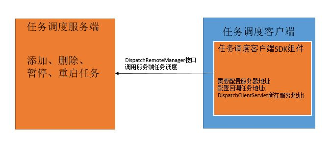

# 后台任务客户端SDK组件概述 #

## 业务需求 ##
应用程序中经常会用到跑定时任务的需求，比如定时垃圾回收。有关任务调度需求有时候很复杂，如每隔多长时间重复执行，一个任务在不同时间段执行等。

## 解决方案 ##

任务调度是基于Quartz开发的，具有简单却强大的机制，能依据事件间隔来调度任务，也可以按照cron表达式来操作。任务调度引擎和组件客户端SDK分离，可减小应用服务器的负荷。

iuap-dispatch-sdk是任务调度客户端SDK组件，该组件可通过客户端接口调用服务端的添加、删除、暂停、恢复、启动定时任务等功能。

## 功能说明 ##

1.	提供独立的任务调度服务；
2.	支持定时任务执行；
3.	支持重复任务执行；
4.	提供任务的新增、暂停、恢复、删除、立即执行接口。
5.	支持集群环境下任务执行唯一；

# 整体设计 #

## 依赖环境 ##

组件采用Maven进行编译和打包发布，依赖Quartz框架,其对外提供的依赖方式如下：

```
	<dependency>
	  <groupId>com.yonyou.iuap</groupId>
	  <artifactId>iuap-dispatch-sdk</artifactId>
	  <version>${iuap.modules.version}</version>
	</dependency>
```

${iuap.modules.version} 为平台在maven私服上发布的组件的version。

## 功能结构 ##


## 流程说明 ##
- 1、用户通过DispatchRemoteManager接口调度任务。
- 2、DispatchRemoteManager接口向服务端发送调度任务请求。
- 3、服务端实现任务调度。
- 4、客户端通过DispatchClientServlet回调任务。

# 使用说明 #

## 组件包说明 ##

iuap-dispatch-sdk是任务调度客户端SDK组件，该组件可通过客户端接口调用服务端的新增、暂停、恢复、删除、立即执行定时任务等功能。

##组件配置##

**1:配置监听Servlet**

  任务调度客户端的配置文件web.xml中配置监听任务调度客户端SDK提供的servlet类地址，用于执行回调任务。

```
    <servlet>
          <servlet-name>DispatchClientServlet</servlet-name>
       	<servlet-class>com.yonyou.iuap.dispatch.client.controller.DispatchClientServlet</servlet-class>
    </servlet>

	<servlet-mapping>
		<servlet-name>DispatchClientServlet</servlet-name>
		<url-pattern>/dispatchClientServlet</url-pattern>
	</servlet-mapping>
```

**2:服务配置**

dispatch-client.properties配置文件字段说明

	dispatch.send.type：任务发送方式，默认HTTP,同时支持SOCKET
	dispatch.server.http.url：服务器地址
	dispatch.recall.type ：任务默认回调方式，默认HTTP,同时支持SOCKET
	dispatch.recall.http.url：任务回调地址

## 工程样例 ##

工程样例可从maven库上下载。例子说明如下：

*(1) 新建任务处理类，需要实现ITask接口*

```
    import java.util.Map;

    import com.yonyou.iuap.dispatch.client.ITask;

    public class TestTaskImpl implements ITask{


	public void execute(Map<String,String> data) {
		//业务操作

	 }
    }
```

*(2) 新增任务*

	**A、简单类型任务**

```
     public void addSimpleTask(Date startDate, TimeConfig timeConfig, String note){
		SimpleTaskConfig taskConfig = new SimpleTaskConfig(UUID.randomUUID().toString()/*任务名*/,
										 "simpleTaskGroup"/*任务组名*/,
										 timeConfig);
		taskConfig.setStartDate(startDate);
		Map<String,String> params = new HashMap<String,String>();
		params.put("note", note);
		boolean success = DispatchRemoteManager.add(taskConfig, TestTaskImpl.class, params, true);
		if(success){
			System.out.println("任务添加成功--"+taskConfig.getJobCode());
		}else{
			System.out.println("任务添加失败--"+taskConfig.getJobCode());
		}
	}
 ```

    **B、Cron类型任务**

```
    public void addCronTask(){
		CronTaskConfig cronTaskConfig = new CronTaskConfig("cronTask", "cronTaskGroup", "* */1 * * * ?");
		Map<String,String> params = new HashMap<String,String>();
		params.put("serverName", System.getProperty("os.name"));//任务可传入附加数据
		boolean success = DispatchRemoteManager.add(cronTaskConfig,TestTaskImpl.class,params,true);
		if(success){
			System.out.println("任务添加成功");
		}else{
			System.out.println("任务添加失败");
		}
	}

```

## 开发步骤 ##

- 加入依赖
```
	<dependency>
	  <groupId>com.yonyou.iuap</groupId>
	  <artifactId>iuap-dispatch-sdk</artifactId>
	  <version>${iuap.modules.version}</version>
	</dependency>
```

${iuap.modules.version} 为平台在maven私服上发布的组件的version。

- 组件配置
  任务调度客户端的配置文件web.xml中需要配置任务调度客户端SDK提供的servlet类地址，用于执行回调任务。

 ```
 <servlet>
          <servlet-name>DispatchClientServlet</servlet-name>
       	<servlet-class>com.yonyou.iuap.dispatch.client.controller.DispatchClientServlet</servlet-class>
    </servlet>

	<servlet-mapping>
		<servlet-name>DispatchClientServlet</servlet-name>
		<url-pattern>/dispatchClientServlet</url-pattern>
	</servlet-mapping>
```

dispatch-client.properties配置文件配置

	dispatch.send.type：任务发送方式，默认HTTP,同时支持SOCKET
	dispatch.server.http.url：服务器地址
	dispatch.recall.type ：任务默认回调方式，默认HTTP,同时支持SOCKET
	dispatch.recall.http.url：任务回调地址，客户端所配置的DispatchClientServlet地址


- 编写任务代码

该类需要实现ITask接口

- 添加任务

使用SDK提供的DispatchRemoteManager类的add方法添加任务。

## API接口 ##

### 指定执行类新增定时任务 ###

**描述**

添加或覆盖简单类型的定时调度任务

**请求方法**

com.yonyou.iuap.dispatch.client.DispatchRemoteManager.add(SimpleTaskConfig simpleTaskConfig, Class<? extends ITask> taskName, boolean replace)

**请求方式**

工具类调用  

**请求参数说明**

<table>
  <tr>
    <th>参数字段</th>
    <th>必选</th>
		<th>类型</th>
    <th>长度限制</th>
    <th>说明</th>
  </tr>
  <tr>
    <td>simpleTaskConfig</td>
    <td>True</td>
		<td>SimpleTaskConfig</td>
    <td>无</td>
    <td>任务执行类</td>
  </tr>
  <tr>
    <td>taskName</td>
    <td>True</td>
		<td>Class</td>
    <td>无</td>
    <td>Cron表达式及相关参数</td>
  </tr>
  <tr>
    <td>replace</td>
    <td>True</td>
		<td>boolean</td>
    <td>无</td>
    <td>是否覆盖，为ture时，自动覆盖，为false时，如果存在会抛出异常</td>
  </tr>
</table>

**返回参数说明**

boolean 成功返回true，否则会抛出异常

### 指定执行类新增带参数的定时任务 ###

**描述**

添加或覆盖简单类型的定时调度任务

**请求方法**

com.yonyou.iuap.dispatch.client.DispatchRemoteManager.add(SimpleTaskConfig simpleTaskConfig, Class<? extends ITask> taskName, Map<String, String> data, boolean replace)

**请求方式**

工具类调用  

**请求参数说明**

<table>
  <tr>
    <th>参数字段</th>
    <th>必选</th>
		<th>类型</th>
    <th>长度限制</th>
    <th>说明</th>
  </tr>
  <tr>
    <td>simpleTaskConfig</td>
    <td>True</td>
		<td>SimpleTaskConfig</td>
    <td>无</td>
    <td>任务执行类</td>
  </tr>
  <tr>
    <td>taskName</td>
    <td>True</td>
		<td>Class</td>
    <td>无</td>
    <td>Cron表达式及相关参数</td>
  </tr>
  <tr>
    <td>data</td>
    <td>FALSE</td>
		<td>Map<String, String></td>
    <td>无</td>
    <td>任务附加数据，以key－value形式增加，仅支持String，在任务执行时传递给任务执行类</td>
  </tr>
  <tr>
    <td>replace</td>
    <td>True</td>
		<td>boolean</td>
    <td>无</td>
    <td>是否覆盖，为ture时，自动覆盖，为false时，如果存在会抛出异常</td>
  </tr>
</table>

**返回参数说明**

boolean 成功返回true，否则会抛出异常

### 指定任务id新增定时任务 ###

**描述**

添加或覆盖简单类型的定时调度任务

**请求方法**

com.yonyou.iuap.dispatch.client.DispatchRemoteManager.add(SimpleTaskConfig simpleTaskConfig,String taskBeanId,Map<String,String> data, boolean replace)

**请求方式**

工具类调用  

**请求参数说明**

<table>
  <tr>
    <th>参数字段</th>
    <th>必选</th>
		<th>类型</th>
    <th>长度限制</th>
    <th>说明</th>
  </tr>
  <tr>
    <td>simpleTaskConfig</td>
    <td>True</td>
		<td>SimpleTaskConfig</td>
    <td>无</td>
    <td>任务执行类</td>
  </tr>
  <tr>
    <td>taskBeanId</td>
    <td>True</td>
		<td>String</td>
    <td>无</td>
    <td>任务执行类BeanId(Spring中配置的BeanID，实现类需要继承com.yonyou.iuap.dispatch.client.ITask接口</td>
  </tr>
  <tr>
    <td>data</td>
    <td>FALSE</td>
		<td>Map<String, String></td>
    <td>无</td>
    <td>任务附加数据，以key－value形式增加，仅支持String，在任务执行时传递给任务执行类</td>
  </tr>
  <tr>
    <td>replace</td>
    <td>True</td>
		<td>boolean</td>
    <td>无</td>
    <td>是否覆盖，为ture时，自动覆盖，为false时，如果存在会抛出异常</td>
  </tr>
</table>

**返回参数说明**

boolean 成功返回true，否则会抛出异常


### 指定执行类新增基于Cron表达式的定时任务 ###

**描述**

添加或覆盖基于Cron表达式的定时调度任务

**请求方法**

com.yonyou.iuap.dispatch.client.DispatchRemoteManager.add(CronTaskConfig cronTaskConfig, Class<? extends ITask> taskName, boolean replace)

**请求方式**

工具类调用  

**请求参数说明**

<table>
  <tr>
    <th>参数字段</th>
    <th>必选</th>
		<th>类型</th>
    <th>长度限制</th>
    <th>说明</th>
  </tr>
  <tr>
    <td>cronTaskConfig</td>
    <td>True</td>
		<td>CronTaskConfig</td>
    <td>无</td>
    <td>Cron表达式及相关参数</td>
  </tr>
  <tr>
    <td>taskName</td>
    <td>True</td>
		<td>Class</td>
    <td>无</td>
    <td>任务执行类</td>
  </tr>
  <tr>
    <td>replace</td>
    <td>True</td>
		<td>boolean</td>
    <td>无</td>
    <td>是否覆盖，为ture时，自动覆盖，为false时，如果存在会抛出异常</td>
  </tr>
</table>

**返回参数说明**

boolean 成功返回true，否则会抛出异常

### 指定执行类新增带参数基于Cron表达式的定时任务 ###

**描述**

添加或覆盖基于Cron表达式的定时调度任务

**请求方法**

com.yonyou.iuap.dispatch.client.DispatchRemoteManager.add(CronTaskConfig cronTaskConfig, Class<? extends ITask> taskName, Map<String, String> data, boolean replace)

**请求方式**

工具类调用  

**请求参数说明**

<table>
  <tr>
    <th>参数字段</th>
    <th>必选</th>
		<th>类型</th>
    <th>长度限制</th>
    <th>说明</th>
  </tr>
  <tr>
    <td>cronTaskConfig</td>
    <td>True</td>
		<td>CronTaskConfig</td>
    <td>无</td>
    <td>Cron表达式及相关参数</td>
  </tr>
  <tr>
    <td>taskName</td>
    <td>True</td>
		<td>Class</td>
    <td>无</td>
    <td>任务执行类</td>
  </tr>
  <tr>
    <td>data</td>
    <td>FALSE</td>
		<td>Map<String, String></td>
    <td>无</td>
    <td>任务附加数据，以key－value形式增加，仅支持String，在任务执行时传递给任务执行类</td>
  </tr>
  <tr>
    <td>replace</td>
    <td>True</td>
		<td>boolean</td>
    <td>无</td>
    <td>是否覆盖，为ture时，自动覆盖，为false时，如果存在会抛出异常</td>
  </tr>
</table>

**返回参数说明**

boolean 成功返回true，否则会抛出异常

### 指定任务Beanid新增基于Cron表达式的定时任务 ###

**描述**

添加或覆盖基于Cron表达式的定时调度任务

**请求方法**

com.yonyou.iuap.dispatch.client.DispatchRemoteManager.add(CronTaskConfig cronTaskConfig,String taskBeanId,Map<String,String> data, boolean replace)

**请求方式**

工具类调用  

**请求参数说明**

<table>
  <tr>
    <th>参数字段</th>
    <th>必选</th>
		<th>类型</th>
    <th>长度限制</th>
    <th>说明</th>
  </tr>
  <tr>
    <td>cronTaskConfig</td>
    <td>True</td>
		<td>CronTaskConfig</td>
    <td>无</td>
    <td>任务执行类</td>
  </tr>
  <tr>
    <td>taskBeanId</td>
    <td>True</td>
		<td>String</td>
    <td>无</td>
    <td>任务执行类BeanId(Spring中配置的BeanID，实现类需要继承com.yonyou.iuap.dispatch.client.ITask接口</td>
  </tr>
  <tr>
    <td>data</td>
    <td>FALSE</td>
		<td>Map<String, String></td>
    <td>无</td>
    <td>任务附加数据，以key－value形式增加，仅支持String，在任务执行时传递给任务执行类</td>
  </tr>
  <tr>
    <td>replace</td>
    <td>True</td>
		<td>boolean</td>
    <td>无</td>
    <td>是否覆盖，为ture时，自动覆盖，为false时，如果存在会抛出异常</td>
  </tr>
</table>

**返回参数说明**

boolean 成功返回true，否则会抛出异常

### 暂停任务 ###

**描述**

 根据任务名称和组名称暂停任务

**请求方法**

com.yonyou.iuap.dispatch.client.DispatchRemoteManager.pauseJob(String jobName, String groupName)

**请求方式**

工具类调用  

**请求参数说明**

<table>
  <tr>
    <th>参数字段</th>
    <th>必选</th>
		<th>类型</th>
    <th>长度限制</th>
    <th>说明</th>
  </tr>
  <tr>
    <td>jobName</td>
    <td>True</td>
		<td>String</td>
    <td>无</td>
    <td>任务名称</td>
  </tr>
  <tr>
    <td>groupName</td>
    <td>True</td>
		<td>String</td>
    <td>无</td>
    <td>组名称</td>
  </tr>
</table>

**返回参数说明**

暂停成功返回NULL，否则返回具体异常原因

### 恢复任务 ###

**描述**

 根据任务名称和组名称恢复任务

**请求方法**

com.yonyou.iuap.dispatch.client.DispatchRemoteManager.resumeJob(String jobName, String groupName)

**请求方式**

工具类调用  

**请求参数说明**

<table>
  <tr>
    <th>参数字段</th>
    <th>必选</th>
		<th>类型</th>
    <th>长度限制</th>
    <th>说明</th>
  </tr>
  <tr>
    <td>jobName</td>
    <td>True</td>
		<td>String</td>
    <td>无</td>
    <td>任务名称</td>
  </tr>
  <tr>
    <td>groupName</td>
    <td>True</td>
		<td>String</td>
    <td>无</td>
    <td>组名称</td>
  </tr>
</table>

**返回参数说明**

暂停成功返回NULL，否则返回具体异常原因

### 删除任务 ###

**描述**

 根据任务名称和组名称删除任务

**请求方法**

com.yonyou.iuap.dispatch.client.DispatchRemoteManager.deleteJob(String jobName, String groupName)

**请求方式**

工具类调用  

**请求参数说明**

<table>
  <tr>
    <th>参数字段</th>
    <th>必选</th>
		<th>类型</th>
    <th>长度限制</th>
    <th>说明</th>
  </tr>
  <tr>
    <td>jobName</td>
    <td>True</td>
		<td>String</td>
    <td>无</td>
    <td>任务名称</td>
  </tr>
  <tr>
    <td>groupName</td>
    <td>True</td>
		<td>String</td>
    <td>无</td>
    <td>组名称</td>
  </tr>
</table>

**返回参数说明**

暂停成功返回NULL，否则返回具体异常原因

### 立即执行任务 ###

**描述**

 根据任务名称和组名称立即执行任务

**请求方法**

com.yonyou.iuap.dispatch.client.DispatchRemoteManager.triggerJob(String jobName, String groupName)

**请求方式**

工具类调用  

**请求参数说明**

<table>
  <tr>
    <th>参数字段</th>
    <th>必选</th>
		<th>类型</th>
    <th>长度限制</th>
    <th>说明</th>
  </tr>
  <tr>
    <td>jobName</td>
    <td>True</td>
		<td>String</td>
    <td>无</td>
    <td>任务名称</td>
  </tr>
  <tr>
    <td>groupName</td>
    <td>True</td>
		<td>String</td>
    <td>无</td>
    <td>组名称</td>
  </tr>
</table>

**返回参数说明**

暂停成功返回NULL，否则返回具体异常原因
