## 自定义档案组件概述

自定义档案组件， 顾名思义，是一个可以管理自己定义的档案的组件。该组件当前包括三大功能模块：即自定义档案建模、自定义档案定义和自定义档案维护。自定义档案建模：允许用户通过页面操作，创建自定义档案模型的分类目录，在分类目录下，可以继续挂载多个自定义档案数据模型；每一个自定义档案数据模型下对应一个数据实体模型（对应到数据库中的表），用户可以自定义数据实体模型的表名、字段名称、字段类型和长度等信息；自定义档案模型的分类目录、数据模型、实体模型支持常规的增、删、查和改。自定义档案定义：在自定义档案建模模块中，用户可以自定义数据的类型，比如字符型、整型、参照类型和下拉类型等，对于复杂的数据类型——参照和下拉，用户需要在自定义档案定义模块中，配置参照和下拉的一些基本属性，例如参照的实体、显示的字段名称等；此外，在这个模块中，可以对维护页面的显示样式和风格进行配置，支持列表显示和树卡显示两种方式；通过自定义档案建模和自定义档案定义中的一些基本配置，整个自定义档案模型就建立完成，此时，需要用户执行发布操作，将定义好的模型固化到本地文件中，最终以Web页面的方式，在自定义档案维护模块中呈现给用户，同时也支持反发布操作，即将数据模型从维护页面中移除；在数据模型发布以后，如果需要更改模型的属性等信息，需要重新发布。自定义档案维护：在这个模块中，用户可以添加自定义的档案数据，例如全国省市区的基本档案，同时也可以管理这些数据，包括对数据的新增、编辑、修改和查询。经过自定义档案建模、自定义档案定义和自定义档案维护三个过程，用户自定义的基本档案信息就创建完成了，对于这些数据，组件支持通过接口调用的方式，供其他组件使用。

自定义档案组件，可以管理基本的档案信息，例如常用的月份、日期、星期、性别等，也可以管理用户自定义的基础数据，例如产品种类、产品类型、产品的颜色等，解决了零碎数据难于集中管理的问题，降低了零碎数据的管理成本，提高了零碎数据的管理效率，同时也提升了零碎数据的使用率和价值，不仅为用户减轻了负担，也为用户增加了效益。

## 技术架构

自定义档案组件的技术架构主要分为三个层次，如图2.1所示。前端技术主要使用了Knockout框架作为基础的架构，Knockout是一款很优秀的JavaScript库，它可以帮助你仅使用一个清晰整洁的底层数据模型（data model）即可创建一个富文本且具有良好的显示和编辑功能的用户界面。任何时候你的局部UI内容需要自动更新（比如：依赖于用户行为的改变或者外部的数据源发生变化），KO都可以很简单的帮你实现，并且非常易于维护；其次，也是使用了Jquery库、原生的js、html、bootstrap、css等，自定义一些组件，辅助Knockout。服务端主要依赖于Spring架构，完成底层的持久化、中间层的数据模型和顶层的数据视图，与Knockout结合，完成整个模块的功能。对于底层数据库，组件支持oracle、mysql。

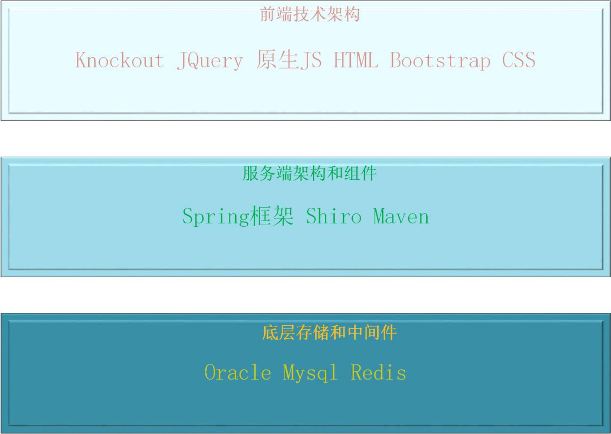

图 1： 组件架构图

## 功能介绍

自定义档案组件主要分为三大功能模块：自定义档案建模、自定义档案定义和自定义档案维护，下面介绍详细的功能。

###  自定义档案建模

自定义档案建模模块中，主要是对档案分类目录、档案模型进行模型层面的维护，具体操作如下。在iuap平台的主页面中，点击右上角的管理中心，进入管理中心页面，点击【自定义档案建模】，进入自定义档案建模管理页面。

#####  目录

在自定义模型管理建模中，左侧是自定义档案分类目录，选中左侧根节点，点击右侧【新增】，选择【档案分类】，即可创建档案分类目录，如图2、3所示

图 2：创建自定义分类目录

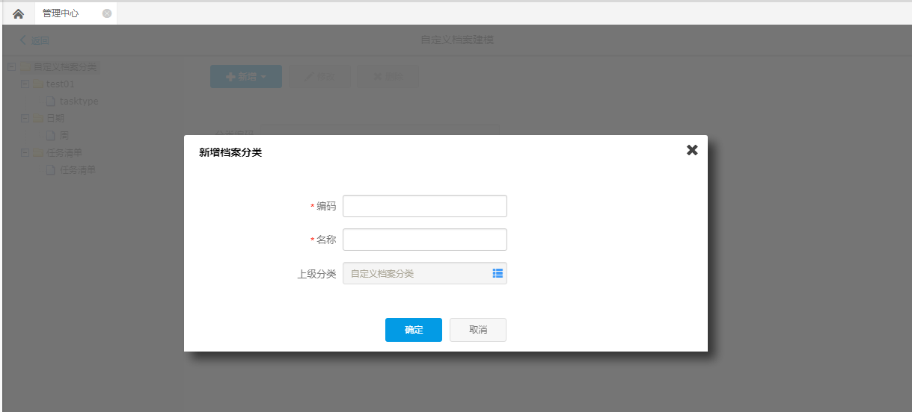

图 3：自定义档案分类目录的新增页面

在图3.2中填好数据后，确定，即成功创建出档案分了目录，如图4所示。

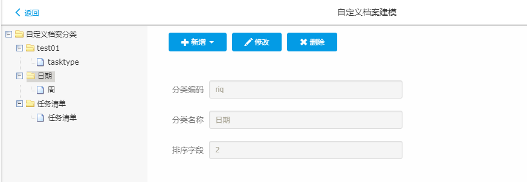

图 4：自定义档案分类目录详情

在图4所示的页面中，可以对目录进行修改和删除操作，过程与新增类似，选中左侧树中的分类目录，点击右侧页面上部的【修改】和【删除】即可。注意：目录下有档案模型和实体，要先删除它们才能删除分类目录。

####  模型

在左侧树中，选择一个分类目录，右侧点击篇【新增】，选择【主数据】，如图5所示。

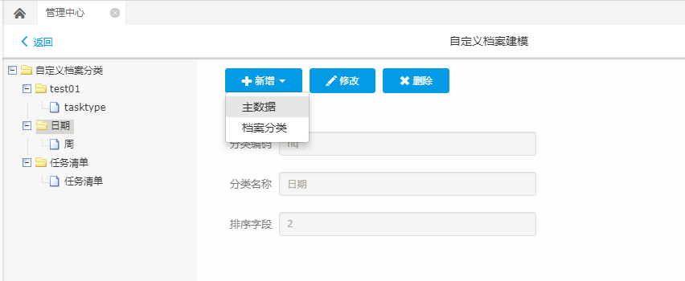

图 5：创建档案主数据模型

打开后，如图6所示。

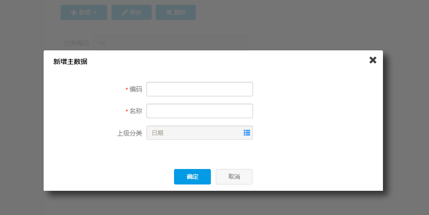

图 6：档案主数据模型的新增页面

填好数据，确定，结果如图7所示

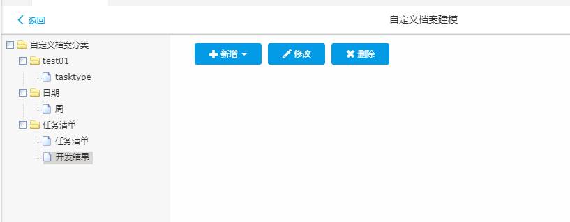

图 7： 档案主数据模型详情

在图7所示的页面中，可以对主数据模型进行修改和删除操作，过程与新增类似，选中左侧树中的模型目录，点击右侧页面上部的修【改和】和【删除】即可。注意：模型下有档案实体，要先删除实体才能删除主数据模型目录。

####  实体

在左侧树中，选中一个主数据模型，右侧点击【新增】，选择【主表】，如图8所示。

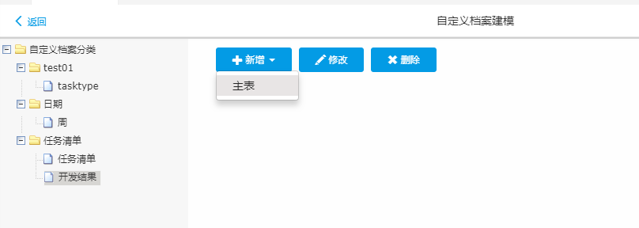

图 8：创建实体（主表）

打开主表新增页面，如图9所示，在页面中，可以添加表的字段名称、编码、长度和类型等，也可以移动字段的顺序。

图 9： 主表创建页面

在图3.8中填写好数据，确定，进入主表实体的维护页面，如图10所示。

图 10：主表（实体）维护页面

在图10中，上部的增加、删除和修改是对左侧目录的操作，包括分类目录和模型目录；右下的编辑和删除才是对主表（实体）操作的，点击编辑，可以对实体的字段属性进行调整，也可以增加和删除字段如图11所示，点击右下删除，是删除实体模型的意思。

图 11：实体字段的维护页面

图11中偏绿色的四个按钮才是变更实体字段的操作按钮

##  自定义档案定义

自定义档案定义模块，主要对已经创建好的档案模型，进行相应的配置，并发布到自定义档案维护页面中，详情如下。

### 下拉配置

如果建模的时候，字段的类型选择了下拉，如图 12的执行时间，就需要在这里进行配置，配置过程如图13所示。

图 12：实体字段类型为下拉

图 13:下拉类型的配置

在自定义档案定义页面，选择左侧模型，右侧点击【配置下拉菜单】，即打开下拉配置的页面，在页面中需要选择被参照的主数据模型和下拉框需要显示的字段。

### 参照配置

如果建模的时候，字段的类型选择了参照，如图14和图15的任务类型，就需要在这里进行配置，配置过程如图16所示。

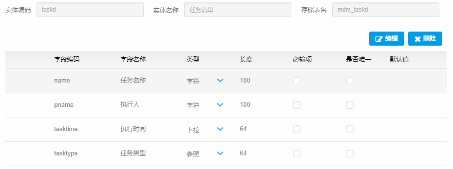

图 14实体字段类型为参照

图 15实体字段类型为参照

图 16：参照类型的配置

在自定义档案定义页面，选择左侧模型，右侧点击【配置参照菜单】，即打开参照配置的页面，在页面中需要选择被参照的主数据模型和参照框需要显示的字段，此外这里还多个一个参照显示风格的选项，这里参照显示的样式，可以是树性，如图17所示，树性显示风格要求被参照的实体，必须有一个参照类型和一个字符字类型，并且要配置上树父id和树节点显示字段名称，如图18所示，也可以是表型，如图19所示。

17：树型参照显示风格

图 18：树型参照配置页面

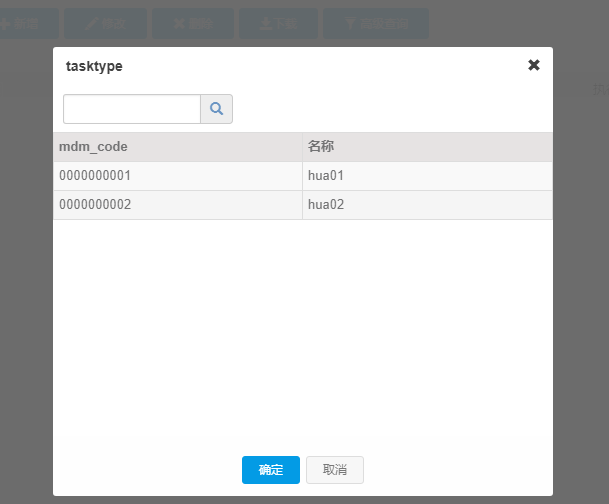

图 19:表型参照显示风格

###  显示配置

自定义档案维护页面的显示样式可在自定义档案中配置，选择【界面风格】，默认表型展示，如图20，也可以配置树卡型，如图21，但是树卡型要求实体模型必须有一个参照类型的字段，并且这个参照配置的时候，被参照的实体，是树卡型实体自己，树父id选择这个实体定义的参照字段，这样才能在自定义档案维护页面展示出不同的页面风格。树卡型在自定义档案维护页面的样式如图22所示，表型的如图23所示。

图 20:自定义档案维护页面的列表型配置页面

图 21：自定义档案维护页面的树卡型配置页面

图 22： 树卡型的显示样式

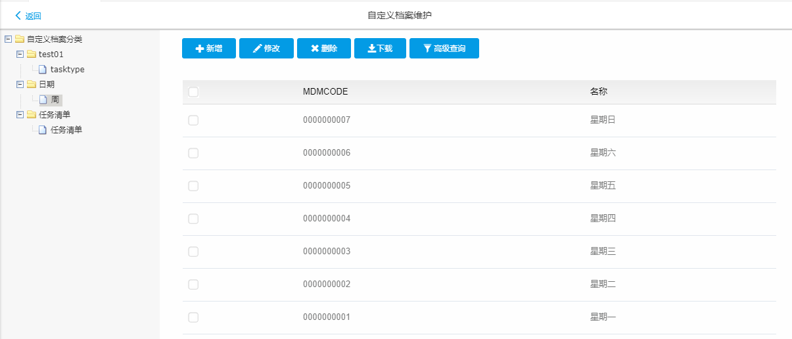

图 23 ：列表型的显示样式

### 发布和反发布

发布即根据模型，生成对应的维护页面，并且将维护页面挂载到自定义档案维护页面的左侧菜单中；反发布即将维护页面从自定义档案维护页面的左侧菜单中移除。

##  自定义档案维护

自定义档案维护页面分为两种：一种是列表，如上图23所示，一种是树卡型，如上图22所示。不管哪一种，页面中都包含基本的数据维护操作：增、删、查和改。下面以列表为例，详细介绍一下数据操作。

###  新增

在自定义档案维护页面左侧，选择数据模型，右侧点击【新增】，打开新增页面，如图24所示，填好数据，保存，完成数据的新增。

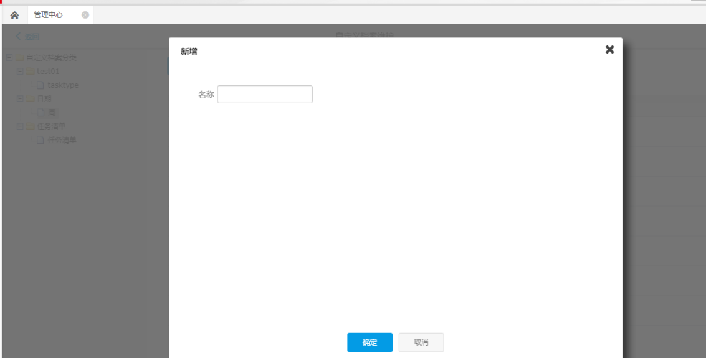

图 24：基础档案数据的新增页面

###  编辑

在自定义档案维护页面左侧，选择数据模型，右侧点击【编辑】，打开编辑页面，如图25所示，更改好数据，保存，完成数据的变更

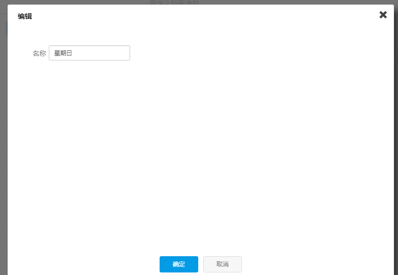

图25：基础档案数据的编辑页面

###  删除

在自定义档案维护页面左侧，选择数据模型，右侧选择要删除的数据，点击【删除】，如图26所示，出现提示，确定，即完成了删除。

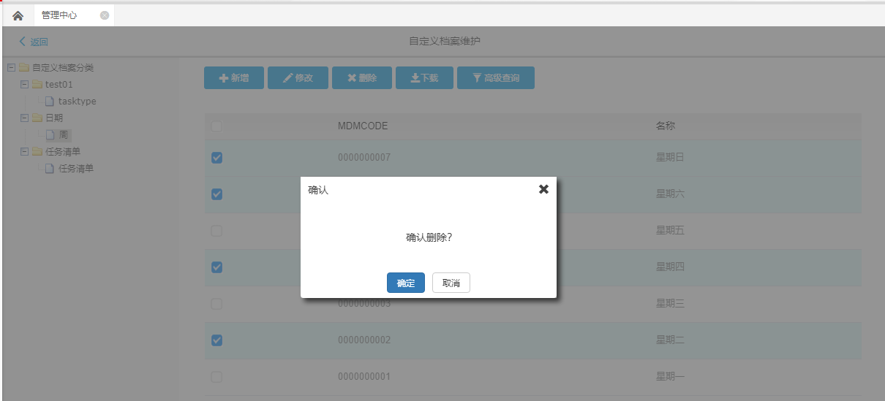

图 26: 基础档案数据的删除页面

###  查询

在自定义档案维护页面左侧，选择数据模型，点击右侧【高级查询】，结果如图27所示，图中左侧是要过滤的字段，右侧是条件（根据字段类型，取不同的值：包含，等于，不等于，大于，小于等），确定，即完成了查询，结果如图28所示。

图 27:基础档案数据的高级查询页面

图 28:基础档案数据的高级查询结果页面

###  下载

在自定义档案维护页面左侧，选择数据模型，右侧选择要下载的数据，点击【下载】，结果如图29所示。注：默认不选中数据的情况下，下载全部。

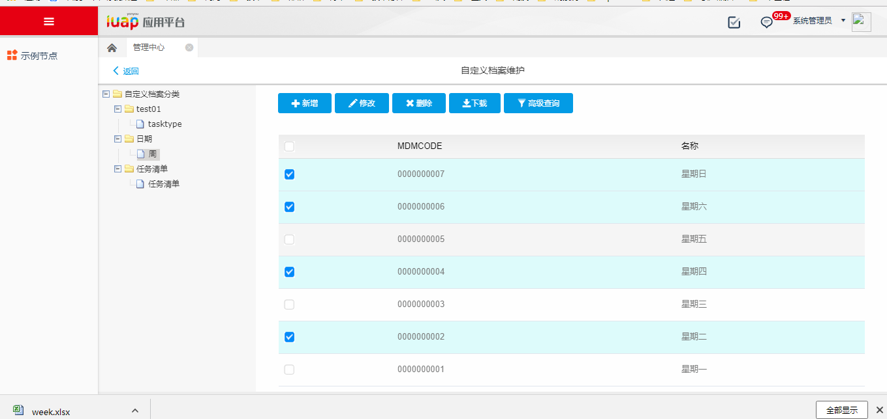

图 29:基础档案数据的下载页面

##  业务场景

在日常的开发中，总会使用到一些基础的数据，作为下拉或者参照使用，下面就以开发任务清单为例，介绍一下自定义档案组件的业务场景。假设开发任务清单中，有一项是星期的字段，即此清单是记录从周一到周日的开发任务计划的。

### 星期类档案建模

在自定义档案建模中，建立星期类的模型，如图30所示。

图 30:星期类档案建模页面

### 星期类档案定义

在自定义档案定义中，发布星期类的模型，如图31所示。

图 31:星期类档案定义页面

### 星期类档案维护

在自定义档案维护中，管理星期类档案的数据，如图32所示。

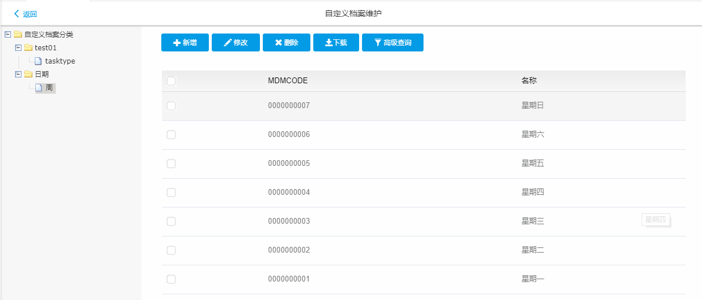

图 32:星期类档案建维护页面

### 开发任务清单

任务清单的维护页面如图所示。

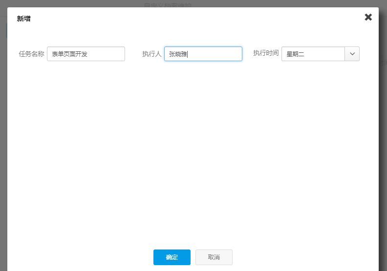

图 33:星期类档案的业务应用场景

上图33中，任务执行时间，就是使用了星期类的档案数据，在开发这个页面的时候，只需要在js文件，通过ajax请求，就可以获取的档案数据，初始化自己的下拉框组件，很是方便。
